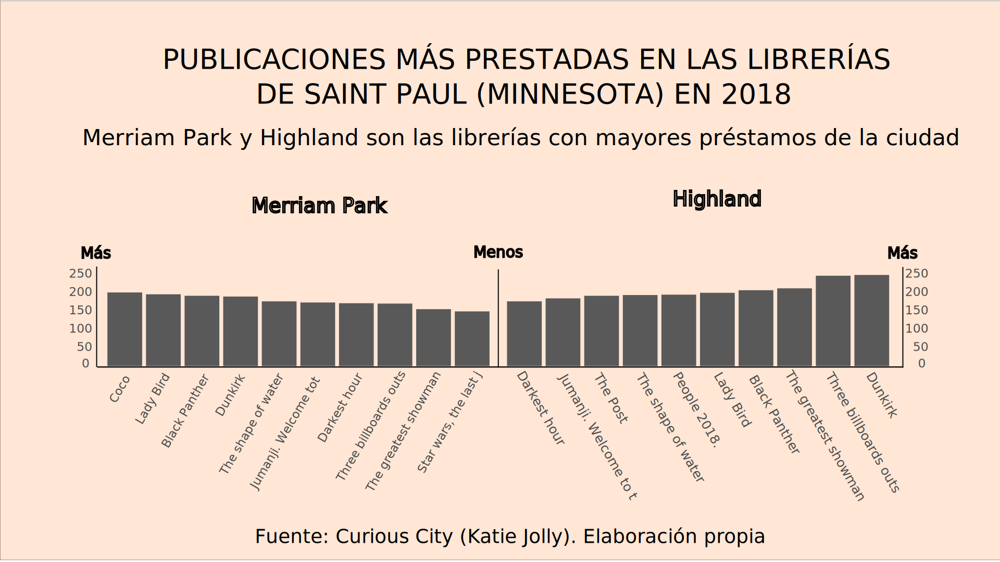
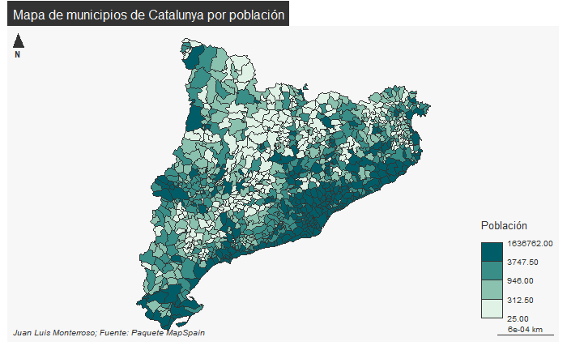
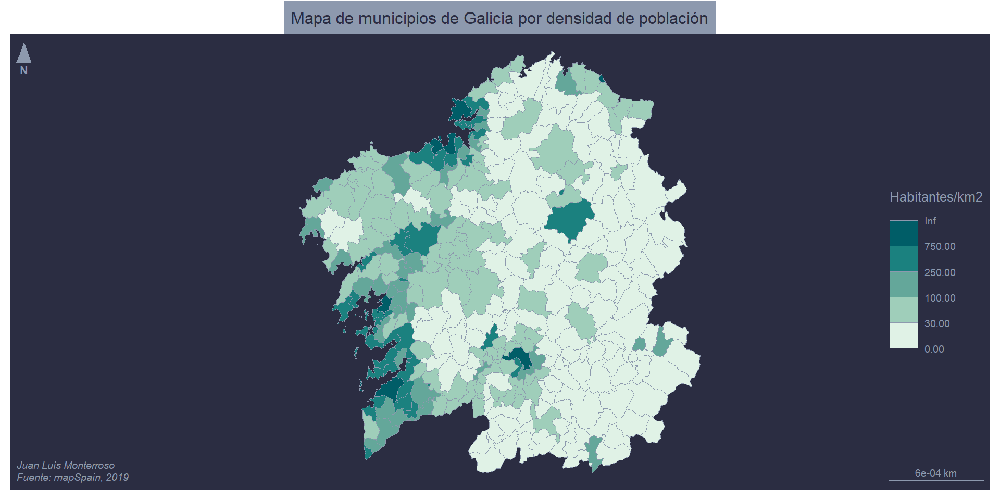
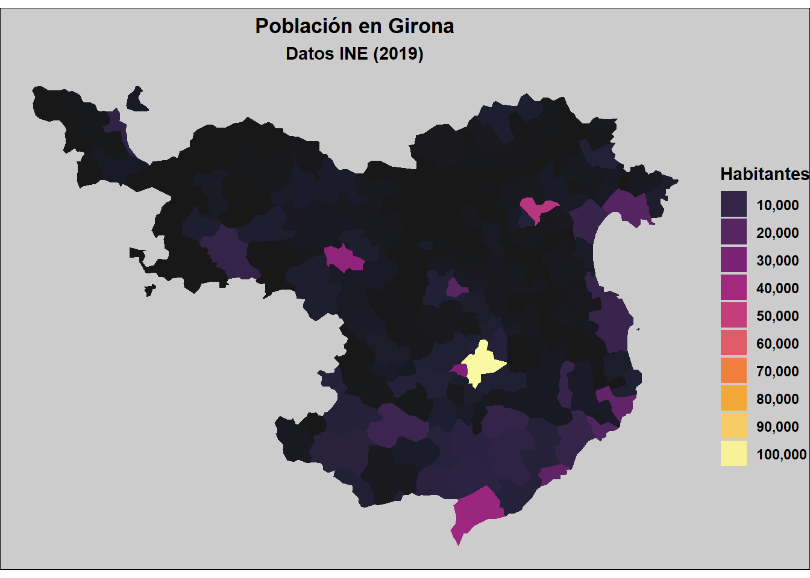
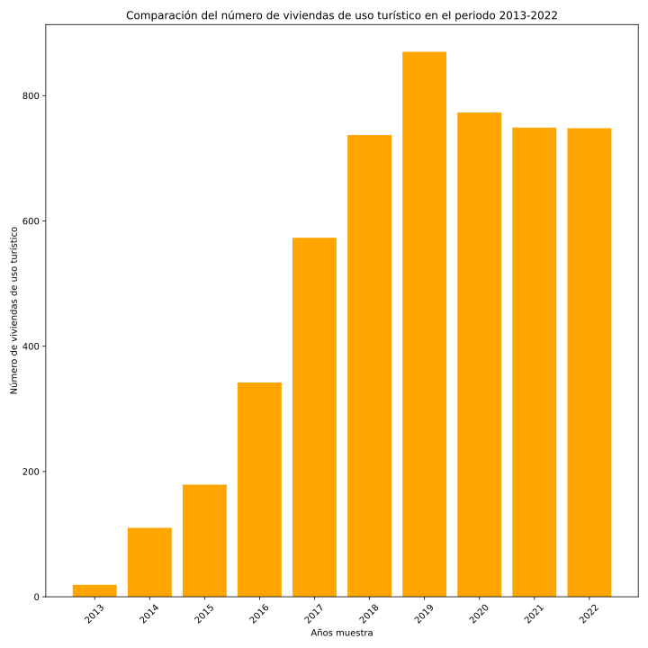
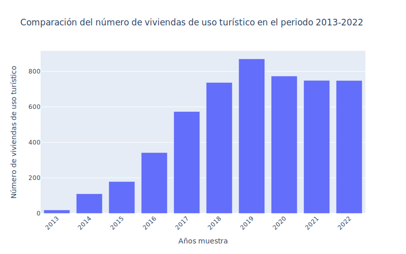

# Ejemplos de infografías

### Juan Luis Monterroso Aranda

## Infografía QGIS

## Infografías Illustrator/Inkscape

## Mapas con Mapsf (R)

## Mapa con ggplot2 (R)

## Gráfico con Matplotlib (Python)

## Gráfico con Plotly (Python)

